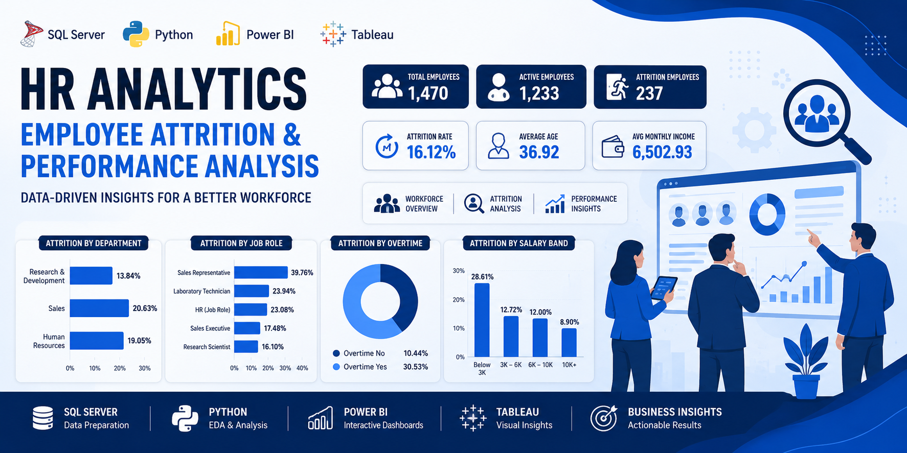
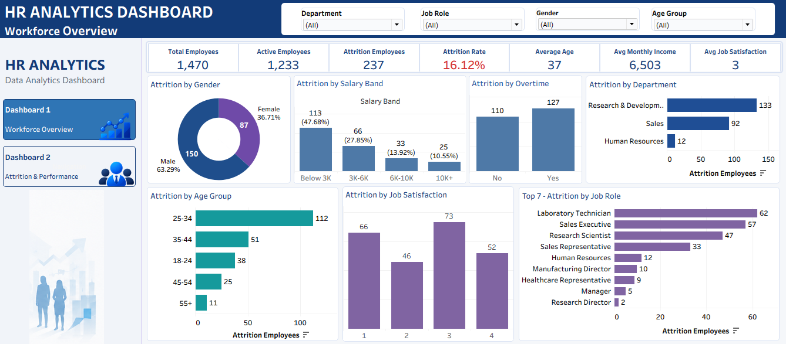
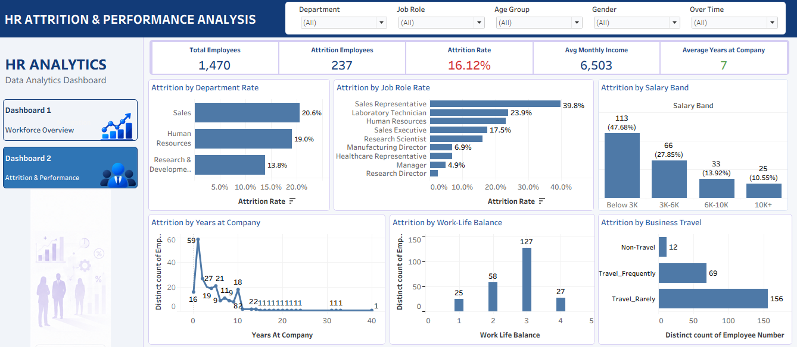

<div align="center">

# 📊 HR Analytics – Employee Attrition & Performance Analysis

<p>
  
</p>

**End-to-End HR Analytics Portfolio Project**

`SQL Server` · `Python` · `Power BI` · `Tableau`

</div>

---

## 📑 Table of Contents

- [📌 Project Overview](#-project-overview)
- [🎯 Business Objectives](#-business-objectives)
- [🔄 Project Workflow](#-project-workflow)
- [🗄️ SQL Server – Data Preparation & Analysis](#️-1-sql-server--data-preparation--analysis)
- [🐍 Python – Exploratory Data Analysis](#-2-python--exploratory-data-analysis)
- [📊 Power BI – Business Intelligence Dashboard](#-3-power-bi--business-intelligence-dashboard)
- [📈 Tableau – HR Analytics Dashboards](#-4-tableau--hr-analytics-dashboards)
- [🧮 Calculated Fields](#-5-calculated-fields)
- [📌 Key Metrics](#-6-key-metrics)
- [📖 Data Dictionary](#-7-data-dictionary)
- [🔎 Key Insights](#-8-key-insights)
- [🛠️ Tools & Technologies](#️-9-tools--technologies)
- [🎯 Skills Demonstrated](#-10-skills-demonstrated)
- [🧭 Dashboard Navigation](#-11-dashboard-navigation)
- [🎨 Dashboard Design & Formatting](#-12-dashboard-design--formatting)
- [📁 Project Structure](#-13-project-structure)
- [🖼️ Dashboard Screenshots](#️-14-dashboard-screenshots)
- [📦 BI Source Files](#-15-bi-source-files)
- [🏆 Project Outcome](#-16-project-outcome)
- [🔐 Public Repository Notes](#-public-repository-notes)
- [👨‍💻 Author](#-author)
- [⭐ Project Highlights](#-project-highlights)

---

## 📌 Project Overview

**HR Analytics – Employee Attrition & Performance Analysis** is an end-to-end data analytics project focused on understanding employee workforce composition, attrition patterns, compensation, job satisfaction, work-life balance, business travel, and employee retention.

The project follows a complete analytics workflow:

**Raw HR Data → SQL Server → Python EDA → Power BI → Tableau → Business Insights**

The main objective is to transform raw employee data into meaningful business insights that can help HR teams understand employee attrition and identify factors associated with employee turnover.

---

## 🎯 Business Objectives

The project aims to answer important HR business questions such as:

* How many employees are currently in the organization?

* What is the overall employee attrition rate?

* Which departments have higher employee attrition?

* Which job roles experience higher employee turnover?

* How does age relate to employee attrition?

* How does salary relate to employee turnover?

* Does overtime influence employee attrition?

* How does job satisfaction relate to attrition?

* Does work-life balance affect employee retention?

* Does business travel influence employee turnover?

* How does employee tenure relate to attrition?

* Which employee segments may require greater retention attention?

---

## 🔄 Project Workflow

```text

Raw HR Dataset

&#x20;     ↓

SQL Server

Data Cleaning + Validation + Advanced SQL Analysis

&#x20;     ↓

Python

Exploratory Data Analysis + Visualization

&#x20;     ↓

Power BI

Interactive Business Intelligence Dashboards

&#x20;     ↓

Tableau

Interactive HR Analytics Dashboards

&#x20;     ↓

Business Insights

```

---

# 🗄️ 1. SQL Server – Data Preparation & Analysis

SQL Server was used for data storage, data cleaning, validation, KPI analysis, and advanced analytical queries.

### Key Activities

* Imported the HR dataset into SQL Server

* Created the HR analytics database

* Created the `HR_Data` table

* Validated data structure and records

* Removed unnecessary columns such as:

&#x20; * `EmployeeCount`

&#x20; * `Over18`

&#x20; * `StandardHours`

* Converted the `Attrition` field from Yes/No into a binary `1/0` flag

* Calculated employee and attrition KPIs

* Performed department-level analysis

* Performed salary ranking analysis

* Identified high-risk departments

### Advanced SQL Concepts Used

* `SELECT`

* `WHERE`

* `GROUP BY`

* `CASE`

* Aggregate Functions

* Conditional Aggregation

* CTEs (Common Table Expressions)

* Window Functions

* Ranking Functions

---

# 🐍 2. Python – Exploratory Data Analysis

Python was used for exploratory data analysis, data validation, visualization, and preparation of the cleaned dataset.

### Libraries Used

* Pandas

* NumPy

* Matplotlib

* Jupyter Notebook

### EDA Activities

* Loaded and inspected the dataset

* Checked dataset structure

* Performed data cleaning

* Analyzed employee attrition

* Analyzed department-wise attrition

* Examined salary distributions

* Analyzed employee age patterns

* Studied relationships between numerical variables

* Created correlation analysis

### Visualizations Created

* Attrition Pie Chart

* Department-wise Attrition Bar Chart

* Box Plots

* Correlation Heatmap

### Python Files

```text

HR\_EDA.ipynb

cleaned\_data.csv

```

---

# 📊 3. Power BI – Business Intelligence Dashboard

Power BI was used to create interactive HR dashboards using DAX measures and business-oriented visualizations.

### Core DAX Measures

* Total Employees

* Active Employees

* Attrition Employees

* Attrition Rate

* Average Monthly Income

### Power BI Dashboards

#### Dashboard 1 – Executive Overview

Provides a high-level overview of:

* Workforce size

* Employee attrition

* Attrition rate

* Workforce demographics

* Department-level trends

#### Dashboard 2 – Employee Demographics & Job Factors

Analyzes employee demographics and job-related factors associated with employee attrition.

#### Dashboard 3 – Salary, Performance & Attrition Insights

Focuses on:

* Salary

* Performance

* Employee retention

* Attrition-related factors

### Additional Features

* Interactive filters

* KPI cards

* Corporate dashboard theme

* Page navigation

* Data Dictionary & Metric Documentation

---

# 📈 4. Tableau – HR Analytics Dashboards

Tableau was used to recreate and enhance the HR analytics solution using the same business logic and analytical definitions.

The final Tableau workbook contains **2 interactive dashboards**.

---

# 📊 Dashboard 1 – HR Workforce & Attrition Overview

This dashboard provides an overall view of the organization's workforce and employee attrition.

## KPIs

* Total Employees

* Active Employees

* Attrition Employees

* Attrition Rate

* Average Age

* Average Monthly Income

* Average Years at Company

## Charts

| Analysis                      | Chart Type     |

| ----------------------------- | -------------- |

| Attrition by Department       | Horizontal Bar |

| Attrition by Job Role         | Horizontal Bar |

| Attrition by Age Group        | Bar Chart      |

| Attrition by Gender           | Donut Chart    |

| Attrition by Overtime         | Bar Chart      |

| Attrition by Job Satisfaction | Bar Chart      |

| Attrition by Salary Band      | Bar Chart      |

## Filters

* Department

* Job Role

* Gender

* Overtime

---

# 📊 Dashboard 2 – HR Attrition & Performance Analysis

This dashboard focuses on deeper analysis of employee attrition and performance-related factors.

## KPIs

* Total Employees

* Attrition Employees

* Attrition Rate

* Average Monthly Income

* Average Years at Company

## Charts

| Analysis                       | Chart Type     |

| ------------------------------ | -------------- |

| Attrition Rate by Department   | Horizontal Bar |

| Attrition Rate by Job Role     | Horizontal Bar |

| Attrition by Salary Band       | Column Bar     |

| Attrition by Years at Company  | Line Chart     |

| Attrition by Work-Life Balance | Column Bar     |

| Attrition by Business Travel   | Bar Chart      |

## Filters

* Department

* Job Role

* Gender

* Age Group

* Overtime

---

# 🧮 5. Calculated Fields

Several calculated fields were created in Tableau to support employee segmentation and attrition analysis.

## Attrition Rate

```text

Attrition Employees / Total Employees

```

The Attrition Rate measures the percentage of employees who left the organization.

---

## Age Group

Employees were segmented into five age groups:

| Age Group | Age Range    |

| --------- | ------------ |

| Under 25  | Below 25     |

| 25–34     | 25 to 34     |

| 35–44     | 35 to 44     |

| 45–54     | 45 to 54     |

| 55+       | 55 and above |

---

## Salary Band

Employees were categorized into four monthly income bands:

| Salary Band | Monthly Income   |

| ----------- | ---------------- |

| Below 3K    | Below 3,000      |

| 3K–6K       | 3,000–6,000      |

| 6K–10K      | 6,000–10,000     |

| 10K+        | 10,000 and above |

---

# 📌 6. Key Metrics

The final analysis uses the following verified project-level metrics:

| Metric | Value |
| --- | ---: |
| Total Employees | 1,470 |
| Active Employees | 1,233 |
| Attrition Employees | 237 |
| Attrition Rate | 16.12% |
| Average Age | 36.92 |
| Average Monthly Income | 6,502.93 |
| Average Years at Company | 7.01 |
| Average Job Satisfaction | 2.73 |
| Average Work-Life Balance | 2.76 |
| Average Performance Rating | 3.15 |

| Metric | Description |
| --- | --- |
| Total Employees | Total number of employees in the dataset |
| Active Employees | Employees who have not left the organization |
| Attrition Employees | Employees who left the organization |
| Attrition Rate | Percentage of employees who left |
| Average Age | Average age of employees |
| Average Monthly Income | Average monthly income of employees |
| Average Years at Company | Average employee tenure |
| Average Job Satisfaction | Average job satisfaction rating |
| Average Work-Life Balance | Average work-life balance rating |
| Average Performance Rating | Average performance rating |

# 📖 7. Data Dictionary

| Column          | Description                                |

| --------------- | ------------------------------------------ |

| EmployeeNumber  | Unique employee identifier                 |

| Age             | Employee age                               |

| Gender          | Employee gender                            |

| Department      | Employee department                        |

| JobRole         | Employee job role                          |

| MonthlyIncome   | Employee monthly income                    |

| YearsAtCompany  | Number of years spent at the company       |

| Attrition       | Whether the employee left the organization |

| Overtime        | Whether the employee works overtime        |

| JobSatisfaction | Employee job satisfaction rating           |

| WorkLifeBalance | Employee work-life balance rating          |

| BusinessTravel  | Frequency of business travel               |

| EducationField  | Employee education field                   |

| JobLevel        | Employee job level                         |

| JobInvolvement  | Employee job involvement level             |

---

# 🔎 8. Key Insights

The analysis focuses on identifying important employee attrition patterns, including:

* Departments with comparatively higher employee attrition

* Job roles with higher employee turnover

* Attrition patterns across different age groups

* Relationship between overtime and employee attrition

* Salary bands associated with employee turnover

* Relationship between job satisfaction and attrition

* Relationship between work-life balance and attrition

* Business travel patterns associated with employee attrition

* Employee tenure and attrition patterns

These insights can help HR teams identify employee segments that may require additional retention strategies.

---

# 🛠️ 9. Tools & Technologies

## Data Analysis

* Python

* Pandas

* NumPy

* Matplotlib

* Jupyter Notebook

## Database

* Microsoft SQL Server

* SQL

* CTEs

* Window Functions

## Business Intelligence

* Microsoft Power BI

* DAX

* Tableau

## Development & Version Control

* Git

* GitHub

---

# 🎯 10. Skills Demonstrated

This project demonstrates practical skills in:

* Data Cleaning

* Data Validation

* Exploratory Data Analysis

* SQL Querying

* Advanced SQL

* CTEs

* Window Functions

* Data Aggregation

* KPI Development

* DAX

* Tableau Calculated Fields

* Data Visualization

* Dashboard Development

* Interactive Filtering

* Dashboard Navigation

* Business Analysis

* HR Analytics

* Data Storytelling

* Cross-Platform BI Development

---

# 🧭 11. Dashboard Navigation

The Tableau dashboards include an interactive navigation bar that allows users to switch between the two dashboards:

```text

HR Workforce & Attrition Overview

&#x20;             ↕

HR Attrition & Performance Analysis

```

The active dashboard button uses a highlighted background to clearly indicate the current dashboard.

---

# 🎨 12. Dashboard Design & Formatting

The dashboards were designed with a clean, professional, and business-oriented layout.

### Design Features

* Consistent dashboard titles

* KPI card formatting

* Consistent chart titles

* Proper chart alignment

* Structured rows and columns

* Balanced dashboard spacing

* Organized filters

* Interactive navigation

* Consistent visual hierarchy

* Business-focused dashboard presentation

---

# 📁 13. Project Structure

The GitHub version of this project is organized to showcase the analysis while avoiding publication of the original Power BI and Tableau packaged files.

```text
HR_Analytics_Portfolio_Project/
│
├── README.md
│
├── 1_Data/
│   └── Cleaned_Data/
│       └── cleaned_data.csv
│
├── 2_SQL/
│   └── HR_Analytics_SQL.sql
│
├── 3_Python/
│   └── HR_EDA.ipynb
│
├── 4_PowerBI/
│   └── HR_Analytics_Dashboard.pdf
│
├── 6_Documentation/
│   ├── Project_Documentation.docx
│   └── Project_Documentation.pdf
│
└── 7_Images/
    ├── Jupyter Notebook/
    │   ├── age_distribution_histogram.png
    │   ├── correlation_heatmap.png
    │   ├── department_attrition_bar_chart.png
    │   └── income_vs_attrition_boxplot.png
    │
    ├── Power BI/
    │   ├── Dashboard_1_Executive_Overview.png
    │   ├── Dashboard_2_Employee_Demographics_Job_Factors.png
    │   ├── Dashboard_3_Salary_Performance_Attrition.png
    │   └── Data_Dictionary_Metric_Documentation.png
    │
    └── Tableau/
        ├── Dashboard_1_Workforce_Overview.png
        └── Dashboard_2_Attrition_Performance.png
```

### Files intentionally excluded from the public GitHub repository

* Original Power BI `.pbix` file
* Original Tableau `.twbx` file
* Raw HR dataset
* Jupyter checkpoint files
* Windows `desktop.ini`

The cleaned dataset is included as the reproducible public analysis dataset.

# 🖼️ 14. Dashboard Screenshots

## Power BI

### Dashboard 1 – Executive HR Overview


### Dashboard 2 – Department Analysis


### Dashboard 3 – Employee Insights


### Data Dictionary & Metric Documentation


## Tableau

### Dashboard 1 – Workforce Overview


### Dashboard 2 – HR Attrition & Performance Analysis


## Jupyter Notebook

### EDA Visualizations


# 📦 15. BI Source Files

The original Power BI and Tableau source files were used during dashboard development but are intentionally not included in the public GitHub repository.

The repository instead includes:

* Power BI dashboard PDF
* Power BI dashboard screenshots
* Tableau dashboard screenshots
* Final project documentation
* SQL analysis
* Python EDA notebook
* Cleaned dataset

This keeps the portfolio repository focused on reproducible analysis and public-facing project evidence.

# 🏆 16. Project Outcome

This project demonstrates an end-to-end approach to solving a real-world HR analytics problem.

Starting from raw employee data, the project covers:

```text

Data Preparation

&#x20;     ↓

SQL Analysis

&#x20;     ↓

Python EDA

&#x20;     ↓

Power BI Development

&#x20;     ↓

Tableau Development

&#x20;     ↓

Dashboard Design

&#x20;     ↓

Business Insights

```

The final solution provides an interactive analytical framework for understanding:

* Workforce composition

* Employee attrition

* Compensation

* Job satisfaction

* Work-life balance

* Business travel

* Employee tenure

* Department and job-role level attrition

The project also demonstrates the ability to apply consistent business logic across **SQL, Python, Power BI, and Tableau**, making it a strong portfolio project for **Data Analyst and Business Analyst roles**.

---

## 🔐 Public Repository Notes

This GitHub repository is prepared as a portfolio version of the project. The public version includes the cleaned dataset, SQL analysis, Python notebook, dashboard PDF/screenshots, and final documentation. Original `.pbix` and `.twbx` files are intentionally excluded from the public repository.

The analysis uses `1 = Left` and `0 = Active` for the binary attrition representation used in the project.

---

## 👨‍💻 Author

### ARKAY

**Data Analytics · SQL · Python · Power BI · Tableau**

---

## ⭐ Project Highlights

```text

✔ End-to-End HR Analytics Project

✔ SQL Server Data Analysis

✔ Advanced SQL Queries

✔ Python Exploratory Data Analysis

✔ Power BI Dashboard Development

✔ Tableau Dashboard Development

✔ DAX Measures

✔ Tableau Calculated Fields

✔ KPI Development

✔ Interactive Filters

✔ Dashboard Navigation

✔ Business-Oriented Insights

✔ Data Visualization

✔ Data Storytelling

✔ Cross-Platform BI Development

✔ Portfolio-Ready Project

```
